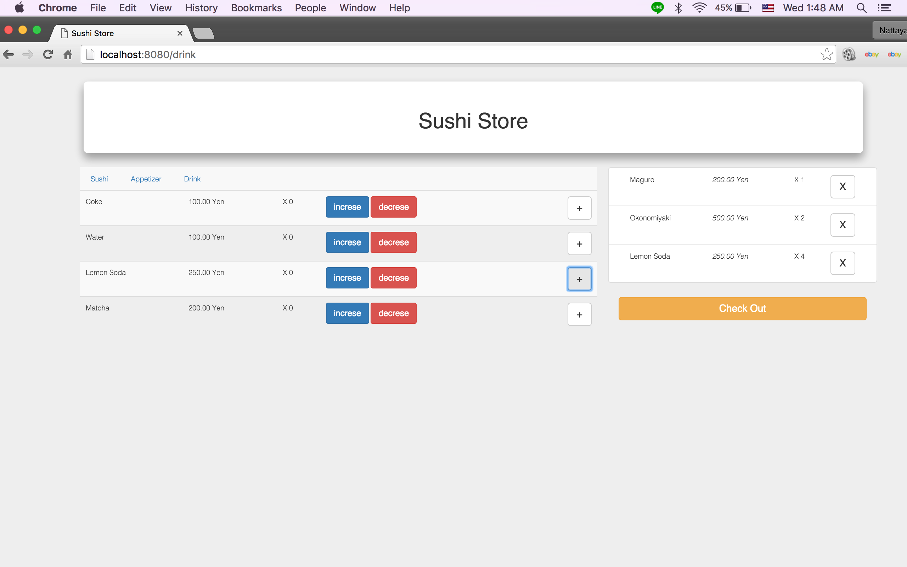
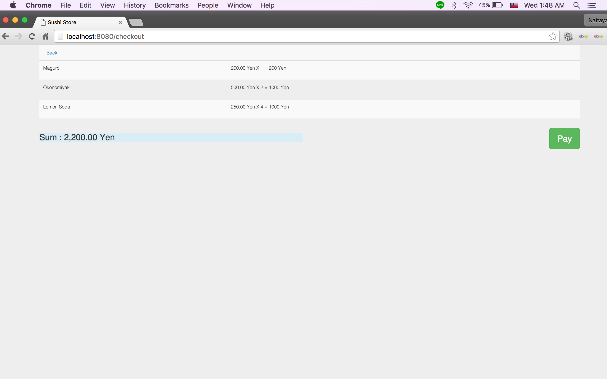

### angular_sushi-store

Build a sample sushi store app using the MEAN stack, along with other modern tools, such as Webpack, SASS, and Babel/ES6.

------------------

### Setup

##### Main Repository
1. `git clone git@github.com:michaelcheng429/angular_sushi-store.git`
2. `cd super-mean-stack`
3. `npm install`
4. `npm run dev`
